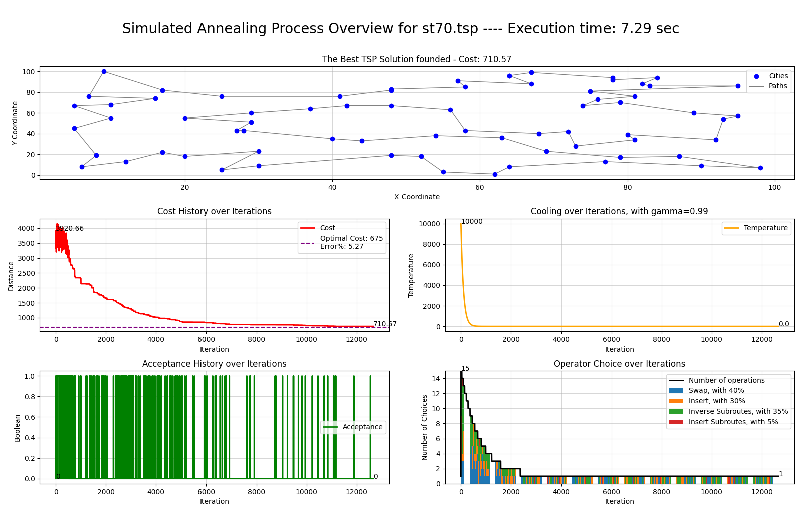

<h1 align="center">Simulated Annealing for the Traveling Salesman Problem (SA-TSP)</h1>

  

    An exploration into metaheuristics for solving the TSP with weighted neighborhood operations and multiple neighborhood operations
  

## Description

The Simulated Annealing for the Traveling Salesman Problem (SA-TSP) project is an immersive journey into the captivating world of metaheuristics, focusing on the classic optimization challenge of the Traveling Salesman Problem (TSP). This project implements a simulated annealing algorithm that incorporates weighted neighborhood operations and multiple neighborhood operations to find near-optimal solutions efficiently.

Key features from the implementation:
1. **Initial Solution Generation**: A random initial solution is created by shuffling city coordinates while ensuring the start point is fixed and the route returns to the origin.
2. **Fitness Evaluation and Distance Calculation**: An efficient fitness function calculates the total route distance using a precomputed distance matrix between all city pairs, guiding the optimization process.
3. **Advanced Neighborhood Operations**: Implements a variety of weighted operators, including swap, insert, inverse subroutes, and insert subroutes to generate neighboring solutions. These operations are applied iteratively and adjusted dynamically based on the system's temperature, enabling a nuanced exploration of the solution space.
4. **Cooling Schedule**: Utilizes an exponential decay function to methodically reduce the temperature, systematically decreasing the probability of accepting worse solutions over time.
5. **Acceptance Criteria**: Probabilistically accepts new solutions based on their fitness and the system's temperature to balance exploration with the goal of finding an optimal solution.

For an in-depth understanding, refer to my articles detailing the journey and findings:
- 🇫🇷 [Sur la Route de l'Optimum: Recuit Simulé pour le TSP](https://medium.com/@mlachahe/sur-la-route-de-loptimum-recuit-simulé-pour-le-tsp)
- 🇬🇧 [On the Route to the Optimum: Simulated Annealing for the TSP](https://www.google.com/search?q=j%27ai+la+flemme+hein+lisez+français+traduction&client=opera&hs=9qX&sca_esv=596363404&sxsrf=AM9HkKlA2C2sF4FMGUoQqk8sPvA97L_8tg%3A1704635155859&ei=E6uaZfiBNKHhkdUP2ruzgA8&ved=0ahUKEwi4177ntMuDAxWhcKQEHdrdDPAQ4dUDCBA&oq=j%27ai+la+flemme+hein+lisez+français+traduction&gs_lp=Egxnd3Mtd2l6LXNlcnAiLmonYWkgbGEgZmxlbW1lIGhlaW4gbGlzZXogZnJhbsOnYWlzIHRyYWR1Y3Rpb24yCBAAGIAEGKIEMggQABiABBiiBDIIEAAYgAQYogQyCBAAGIAEGKIESOvsAVCuBli62AFwBngBkAEAmAFnoAHCFqoBBDQxLjG4AQzIAQD4AQHCAgoQABhHGNYEGLADwgIKECEYChigARjDBMICBRAhGKAB4gMEGAAgQYgGAZAGCA&sclient=gws-wiz-serp)

## Repository Structure

- `README.md`: This file with all the information about the project.
- `SimulatedAnnealing_TSP.ipynb`: The main Jupyter notebook with the implementation.
- `results_tsp_2024_01_04_18_26_30`: Folder with the algorithm's output results using various parameters.
- `tableau_recapitulatif.ods`: A summary table of algorithm performance across different benchmarks.

## Results

Our simulated annealing algorithm was tested against well-established benchmarks from TSPLIB. The performance metrics on benchmarks such as `ulysses22.tsp`, `berlin52.tsp`, `st70.tsp`, and `ch130.tsp` demonstrate the effectiveness of our approach.

- The results highlight the importance of selecting the right parameters for simulated annealing and neighborhood strategy.

The following graph illustrates the convergence pattern of the algorithm over iterations for a selected benchmark:

This graph depicts the algorithm's ability to reduce the total distance (cost function) over time, indicating the efficiency of our simulated annealing implementation in exploring the solution space.

## Contact #

If you have any questions or would like to connect:

- 📬 Email me at [mlachahe.saidsalimo@gmail.com](mailto:mlachahe.saidsalimo@gmail.com)
- Connect with me on [LinkedIn](https://www.linkedin.com/in/mlachahesaidsalimo/)
- Read my thoughts on [Medium](https://medium.com/@mlachahesaidsalimo)

